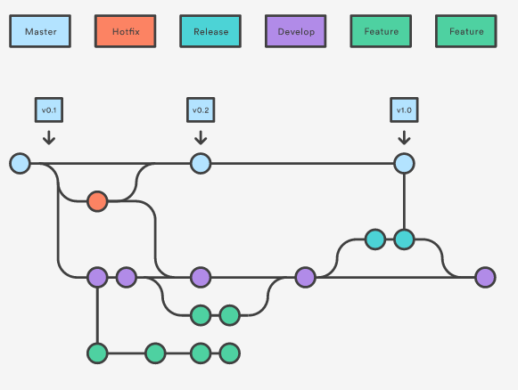

# Introduction to Git

---

## Why Are We Here?

@ul
- Development is being migrated away from internally hosted Team Foundation Servers to Azure DevOps
- On TFS we are using TFS Version Control, Azure DevOps uses Git for version control
- Git and TFSVC are different which can cause confusion
- Damien has offered to buy a Dishoom breakfast for anyone who attends
@ulend

---

## Outline

@ul
- A quick overview of Git
- A demo of Git
- A chance to experiment with Git in the Scratch environment
@ulend

---

## Simple But Powerful

@ul
- The underlying concept of Git is beautifully simple, based around the commit 
- Each commit describing the changes from the previous commit
- Whilst simple, this concept is also tremendously powerful
@ulend

---

---

# But...

---

---

# Defenestrate Regularly

---

---

## Beginnings

@ul
- Git started life as a week long project to replace the version control system managing contributions to the Linux Kernel 
- It had to be:
    - Fast
    - Simple Design
    - Strong support for non-linear development
    - Fully distributed
    - Able to handle large projects efficiently
@ulend

---

## Beginnings

@ul
- It is now almost the defacto standard for version control systems
- For a long while despite producing their own version control system for TFS, Microsoft teams were internally using Git
@ulend

---

## Top Tip

@ul
- When learning to use Git, try to *not* think about it in the same way as you do for existing version control systems 
- Git stores and thinks about information differently from these systems and it can get confusing
@ulend

---

## Snapshots not Differences 

@ul
- Many other version control systems store information as details of changes to files
- Git thinks of its data more like a set of snapshots of a miniature file system, called a commit 
- It uses links for unchanged files saving space
- It only stores the changes not complete files
@ulend

---

## Nearly every operation is local 

@ul
- Git is designed to operate in a distributed way so has the entire history of a project locally
- If you need to go back to an old version of the file, Git can regenerate it locally 
- If a server repository fails or is corrupted the server can be built from local repositories
@ulend

---

## Git has integrity

@ul
- Everything in Git is check-summed before it is stored
- Internally everything is referred to by that checksum, not a filename 
- You can't lose information in transit or have a file corrupt without Git knowing about it
@ulend

---

## Git generally only adds data

@ul
- It is very hard to get Git to remove or erase data from its internal database 
- Removing files *adds* a snapshot
- This makes it straightforward to step back on problems
@ulend

---

## Git vs TFS

|TFS Version Control|Git|
|---|---|
|Workspace|Repository / Repo|
|Get Latest  (First time)|Clone|
|Get Latest|Pull|
|Check in|Commit + Push|
|Check out|(just start typing)|

---

## Git vs TFS

|TFS Version Control|Git|
|---|---|
|Branch|Branch|
|Merge|Merge (or Rebase instead)|
|Code Review|“pull request”|
|Shelveset|Stash|
|Label|Tag|

---

## Git Tools

You don't have to use the command line (although some of the power is only available that way)

@ul
- Modern Visual Studio has Git support built in
- Free clients like Atlassian SourceTree, Tortoise Git, Git for Windows
- Paid for clients like Git Kraken, Smart Git or Tower
@ulend

---

## Git Resources

Lots of Git resources and support around:

@ul
- Pro Git - Whole book is available for free online at [https://git-scm.com/book/en/v2](https://git-scm.com/book/en/v2)
- Several Pluralsight courses can teach you the basics, or take a deep dive into how Git works
- Atlassian Git Cheat Sheet [https://www.atlassian.com/git/tutorials/atlassian-git-cheatsheet](https://www.atlassian.com/git/tutorials/atlassian-git-cheatsheet)
@ulend
